# 🚀 CRAG: Corrective Retrieval-Augmented Generation Pipeline (v2.0)


## 📌 Overview

**CRAG** is a high-performance **Corrective Retrieval-Augmented Generation** system designed to provide accurate, reliable, and verifiable answers to complex queries. By leveraging a state-of-the-art **LangGraph** orchestration, CRAG ensures that information is not only retrieved but also evaluated for relevance and correctness in real-time.

This version (v2.0) is production-optimized for deployment on **Render** (Backend) and **Vercel** (Frontend), featuring a lightweight embedding engine to stay within resource constraints while maintaining enterprise-grade performance.

---

## ✨ Key Features

- 🧠 **Dynamic Evaluation**: Every retrieved chunk is scored for relevance. Incorrect or ambiguous retrievals trigger an automated web-search fallback.
- � **Secure Authentication**: JWT-based user signup/login system with isolated data storage.
- 📂 **Persistent Sessions**: Full chat history and document management stored in a cloud-hosted PostgreSQL database (**Neon**).
- �🔍 **Multi-Source Ingestion**: Ingest knowledge from PDFs (via **Docling**), web pages, and YouTube video transcripts.
- 🏗️ **LangGraph Orchestration**: A robust state-machine architecture that manages complex branching logic (Retrieve → Evaluate → Rewrite → Search → Refine → Generate).
- ⚡ **Optimized Inference**: Powered by **Groq (Llama 3.3 70B)** and **FastEmbed** for lightning-fast, memory-efficient performance.
- 🎨 **Modern Interactive UI**: A React-based interface featuring a live graph visualizer to track the AI's "thought process" step-by-step.

---

## 🏗️ Technical Workflow & Architecture

The CRAG system is architected to handle diverse data sources with a robust ingestion-to-inference pipeline.

### 📥 Ingestion & Storage Pipeline
The ingestion layer transforms unstructured data into structured knowledge using a multi-stage process:

1.  **Extraction**: PDF (Docling/PyMuPDF4LLM), Web (BeautifulSoup), YouTube (Transcripts).
2.  **Transformation**: Recursive Character Text Splitting for context-aware chunking.
3.  **Vectorization**: **FastEmbed (BAAI/bge-small-en-v1.5)** — Lightweight ONNX-optimized embeddings for production stability.
4.  **Indexing**: High-performance upserts into **Qdrant** (Local/Cloud).

### 🔄 Retrieval & Reasoning (CRAG Logic)


---

## 🛠️ Technology Stack

| Layer | Technologies |
| :--- | :--- |
| **Backend** | FastAPI, Python 3.11+ |
| **Orchestration** | LangGraph, LangChain |
| **LLM Inference** | Groq (Llama 3.3 70B Versatile) |
| **Embeddings** | FastEmbed (ONNX Optimized) |
| **Vector DB** | Qdrant Cloud / Local Persistent |
| **Relational DB** | Neon (PostgreSQL) + SQLAlchemy (Async) |
| **Frontend** | React 18, Vite, Tailwind CSS, Axios |
| **Deployment** | Render (Backend), Vercel (Frontend) |

---

## 🚀 Getting Started

### 1️⃣ Backend Setup
```bash
# Navigate to backend
cd backend

# Create virtual environment
python -m venv .venv
source .venv/bin/activate # or .venv\Scripts\activate on Windows

# Install dependencies
pip install -r requirements.txt

# Create .env file with:
# GROQ_API_KEY=your_key
# TAVILY_API_KEY=your_key
# QDRANT_URL=your_qdrant_url
# QDRANT_API_KEY=your_api_key
# DATABASE_URL=your_neon_db_url
# SECRET_KEY=your_jwt_secret

# Run server
uvicorn main:app --reload
```

### 2️⃣ Frontend Setup
```bash
# Navigate to frontend
cd frontend

# Install dependencies
npm install

# Create .env file with:
# VITE_API_URL=http://localhost:8000

# Start development server
npm run dev
```

---

## ☁️ Deployment

### **Backend (Render)**
The project includes a `render.yaml` for easy deployment.
1. Connect your GitHub repo to Render.
2. Render will automatically detect the blueprint and provision the service.
3. Add your Environment Variables in the Render dashboard.

### **Frontend (Vercel)**
1. Push the code to GitHub.
2. Link the `frontend/` directory to a new project on Vercel.
3. Set `VITE_API_URL` to your Render service URL.

---

## 🔮 Future Improvements

- [ ] **Dynamic Thresholding**: Implement RL-based threshold adjustment for the document evaluator.
- [ ] **Hybrid Search**: Integrate BM25 (keyword-based) search along with semantic vector search.
- [ ] **WebSocket Streaming**: Real-time token streaming for faster perceived response times.
- [ ] **Agentic Tools**: Allow the pipeline to use specialized tools (e.g., Code Executor) during the Refine phase.

---

## 📝 License

Distributed under the MIT License. See `LICENSE` for more information.

---

<p align="center">Made with ❤️ for the GenAI Community</p>
